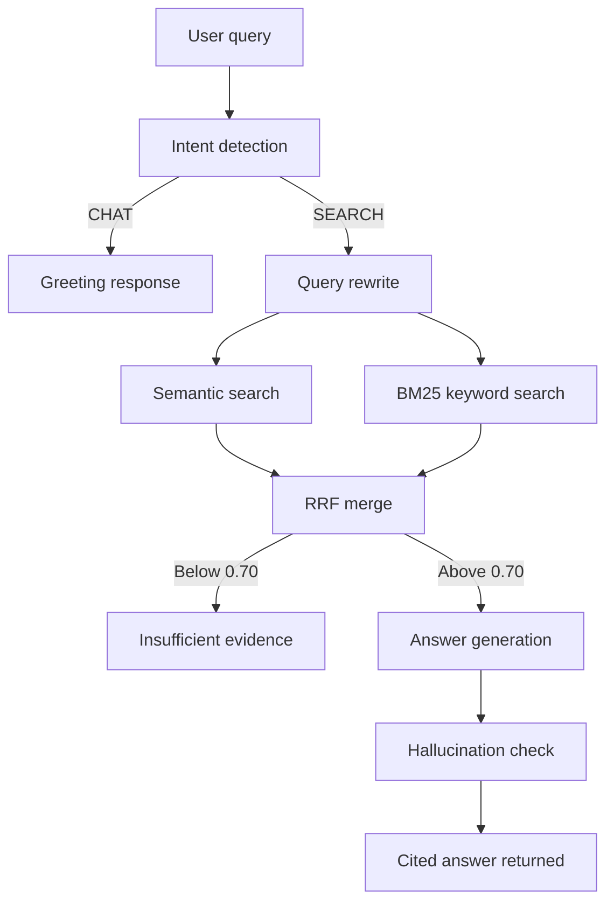

# Clinical Protocol Assistant

A retrieval-augmented generation pipeline for authoritative clinical
guidelines across musculoskeletal, cardiovascular, and pain management
domains.

## Clinical context

This system is designed for clinicians, care coordinators, and
utilization management nurses who need fast, evidence-grounded answers
from authoritative clinical guidelines at the point of care.Clinicians and care teams can upload authoritative PDF guidelines and
ask natural language questions.

The knowledge base covers three clinical domains:

Musculoskeletal — the AAOS ACL Clinical Practice Guideline 2022 and
the Carelon Joint Surgery Clinical Appropriateness Guidelines 2024
support questions about ACL reconstruction, joint surgery criteria,
return to sport, and orthopedic prior authorization requirements.

Cardiovascular — the ACC/AHA/HFSA Heart Failure Guideline 2022
supports questions about HFrEF and HFpEF treatment, GDMT, LVEF
thresholds, device therapy, and comorbidity management.

Pain management — the CDC Clinical Practice Guideline for Prescribing
Opioids 2022 supports questions about opioid initiation, dosage,
duration, and risk assessment for acute, subacute, and chronic pain.

Every answer is grounded in the uploaded documents and includes
citations to the source file and page number. The system refuses to
answer when retrieved evidence does not meet a minimum confidence
threshold of 70 percent, preventing hallucinated clinical guidance.

---

## System design

The pipeline has four stages that run in sequence for every query.

**Ingestion** — PDF files are extracted page by page using pdfplumber,
which handles the structured layout of clinical guidelines better than
simpler PDF parsers. Each page is split into 512-token chunks with a
50-token overlap using tiktoken. The overlap prevents clinical concepts
that span a chunk boundary from being lost. Each chunk is embedded
using the Mistral mistral-embed model and stored as a raw numpy array
in a local SQLite database. No external vector database is required.

**Retrieval** — when a query arrives the system runs two independent
searches in parallel. Semantic search embeds the query and computes
cosine similarity against every stored chunk. BM25 keyword search
scores chunks based on term frequency and inverse document frequency,
catching exact clinical terms like drug names or ICD codes that
semantic search can miss. The two ranked lists are merged using
Reciprocal Rank Fusion with k=60, which is more stable than averaging
raw scores because it is not sensitive to scale differences between
cosine similarity and BM25 scores. If the top chunk similarity is
below 0.70 the system returns an insufficient evidence response
instead of generating an answer.

**Generation** — the top five chunks are formatted into a numbered
context block with source filenames and page numbers. Mistral
mistral-large-latest generates an answer instructed to cite every
claim using the format [Source: filename, Page: number]. A second
Mistral call runs a hallucination check that removes any claim not
supported by the retrieved passages.

**Intent detection** — before retrieval the query is classified as
SEARCH or CHAT. Conversational messages like greetings never trigger
a knowledge base search. Clinical queries are also rewritten by
Mistral into concise search phrases before embedding, which improves
retrieval quality by removing conversational filler words.

### Architecture diagram
## Architecture diagram

---

## Knowledge base

The system is pre-loaded with five authoritative clinical guidelines:

- AAOS Management of ACL Injuries Clinical Practice Guideline 2022
- ACC/AHA/HFSA Guideline for the Management of Heart Failure 2022
- CDC Clinical Practice Guideline for Prescribing Opioids 2022
- Carelon Joint Surgery Clinical Appropriateness Guidelines 2024
- CMS Medicare Advantage Coverage Documentation 2024

---

## Running the project

**Requirements** — Python 3.10 or higher, a Mistral AI API key.

**Install dependencies**
pip install -r requirements.txt

**Set environment variable** — create a .env file in the project root:
MISTRAL_API_KEY=your_key_here

**Ingest documents** — place PDF files in data/pdfs/ then run:
python scripts/seed_demo.py

**Start the API server**
uvicorn server.main:app --reload

**Start the frontend** — in a separate terminal:
streamlit run frontend/app.py

The UI opens at http://localhost:8501

---

## API endpoints

**POST /ingest** — upload one or more PDF files for ingestion.
Returns a summary per file showing pages extracted and chunks stored.

**POST /query** — submit a question as JSON with a question field.
Returns the answer, source filenames, intent classification, and
retrieval confidence score.

**GET /health** — confirms the server is running.

---

## Technical decisions

**SQLite and numpy instead of a vector database** — keeps the project
fully self-contained with no external services. Embeddings are stored
as raw bytes and loaded into memory for search. For the scale of
clinical guideline documents this is faster than making network calls
to an external database.

**BM25 implemented from scratch** — no external search library is
used. The BM25 algorithm is approximately 60 lines of pure Python.
This satisfies the task requirement and makes the retrieval logic
fully transparent and auditable.

**Reciprocal Rank Fusion** — chosen over score averaging because RRF
is robust to scale differences. Cosine similarity scores range from
0 to 1 while BM25 scores are unbounded, so averaging them directly
would give BM25 disproportionate influence.

**Two-call generation** — the hallucination check adds one additional
Mistral call per query but significantly reduces the risk of the model
adding clinical claims not supported by the retrieved text. In a
healthcare context this is worth the latency cost.

## Chunking considerations

PDF text extraction uses pdfplumber over PyPDF2 because clinical guidelines
contain structured tables, multi-column layouts, and graded recommendation
headers. pdfplumber preserves spatial layout during extraction. PyPDF2 reads
characters in stream order which concatenates columns incorrectly for
multi-column clinical documents.

Chunk size is fixed at 512 tokens with 50-token overlap using the
cl100k_base tiktoken encoding. 512 tokens represents approximately one to
two clinical paragraphs — enough context to capture a recommendation along
with its qualifying conditions and rationale. Smaller chunks (256 tokens)
lose clinical context; larger chunks (1024 tokens) introduce noise from
unrelated content on the same page.

The 50-token overlap prevents clinical criteria that span a chunk boundary
from being split across two incomplete chunks. A criterion like "ACL
reconstruction is recommended when the patient has failed conservative
therapy AND presents with functional instability" must appear intact in at
least one chunk to be retrieved correctly.

Fixed-size chunking was chosen over semantic chunking because clinical
guidelines have consistent paragraph structures that align naturally with
fixed windows. Semantic chunking adds complexity without measurable
retrieval benefit for structured regulatory documents.

---
## Libraries used

- [FastAPI](https://fastapi.tiangolo.com) — async Python web framework, automatic OpenAPI docs
- [Uvicorn](https://www.uvicorn.org) — ASGI server for FastAPI
- [Streamlit](https://streamlit.io) — frontend chat UI
- [Mistral AI](https://docs.mistral.ai) — embeddings (mistral-embed) and generation (mistral-large-latest)
- [pdfplumber](https://github.com/jsvine/pdfplumber) — PDF text extraction preserving clinical layout
- [tiktoken](https://github.com/openai/tiktoken) — token-aware chunking using cl100k_base encoding
- [NumPy](https://numpy.org) — vector operations and embedding storage as raw bytes
- [SQLite3](https://docs.python.org/3/library/sqlite3.html) — embedded database, Python standard library
- [Pydantic](https://docs.pydantic.dev) — request and response validation models
- [python-dotenv](https://github.com/theskumar/python-dotenv) — environment variable loading from .env