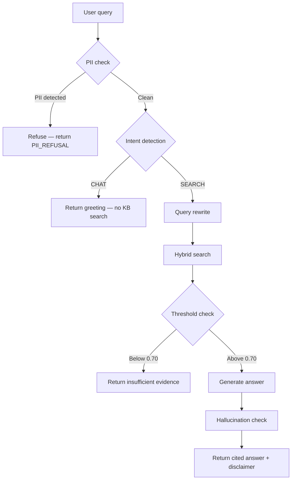
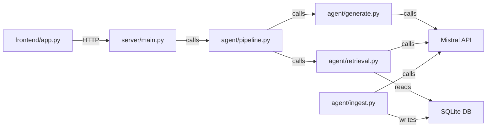
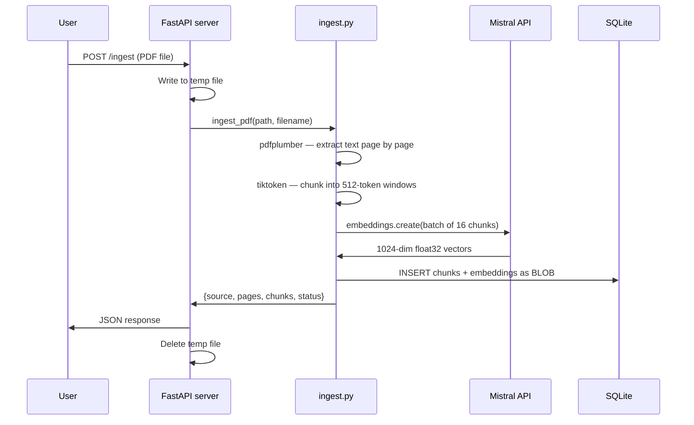
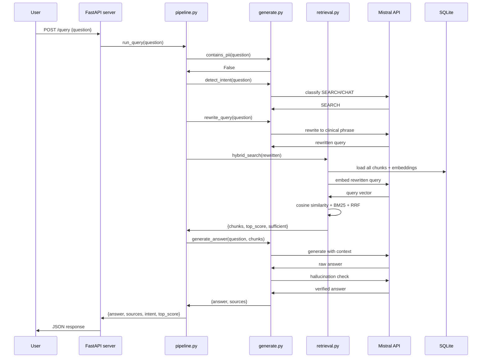

# 01 — System Architecture

## What this system is

The Clinical Protocol Assistant is a retrieval-augmented generation
pipeline. It is not a chatbot, not a search engine, and not a language
model. It is a deterministic engineering pipeline where a clinical
question goes in and a cited, evidence-grounded answer comes out.

Every stage is explicit, auditable, and independently testable. The
design deliberately avoids end-to-end "magic" — each component does
one thing and can be replaced or upgraded without touching the others.

---

## The five-stage pipeline

### Stage 1 — PII check

Runs before any external API call. Regex patterns scan for SSNs, MRNs,
dates of birth, and explicit patient name patterns. If any match, the
query is refused immediately and no data leaves the server.

**Why first:** Patient data must never reach the Mistral API. A UM nurse
typing a patient scenario containing a name and DOB would otherwise send
PHI to a third-party LLM provider. The check costs nothing — zero API
calls — and prevents a HIPAA violation.

**Gap in current implementation:** The regex patterns cover common
formats but not all PHI. A production deployment would add a dedicated
PHI detection model (e.g., Microsoft Presidio or AWS Comprehend Medical)
and log all refusals for audit.

---

### Stage 2 — Intent detection

A single Mistral call with `temperature=0.0` and `max_tokens=5`
classifies the query as SEARCH or CHAT. Conversational queries — greetings,
off-topic questions, system questions — return immediately without
triggering any knowledge base operations.

**Why before retrieval:** Embedding a query costs an API call. Loading
all chunks into memory and computing cosine similarity costs CPU time.
For a query like "hello" these costs are wasted. Intent detection is
cheap (5 tokens out, 100 tokens in) and saves the full retrieval cost
on every non-clinical query.

**Edge cases handled:** The classifier returns "SEARCH" if the word
SEARCH appears anywhere in the response — this handles cases where the
model adds punctuation or wraps the word in quotes.

---

### Stage 3 — Query rewrite

A second Mistral call rewrites the user's natural language question into
a concise clinical search phrase. The rewritten query is what gets
embedded and searched.

**Why rewrite:** Clinical guidelines are written in formal, structured
language. A user might ask "what should I do for a patient with bad
knee pain after sports injury" — the embedding of that phrase is pulled
toward words like "should", "do", "bad", "sports". The rewritten query
"ACL injury conservative management clinical criteria" has an embedding
that sits close to the relevant guideline text.

**Example:**

| Original | Rewritten |
|---|---|
| "wat r the recomendashions 4 ACL surgry" | "ACL reconstruction indications skeletally mature patient" |
| "my patient has heart failure what drugs" | "heart failure reduced ejection fraction first-line pharmacotherapy" |
| "how long can you give opioids for back pain" | "opioid prescribing duration acute musculoskeletal pain CDC guideline" |

---

### Stage 4 — Hybrid search

Two independent search algorithms run in parallel on the rewritten query.
Their results are merged using Reciprocal Rank Fusion.

**Semantic search:** The query is embedded using `mistral-embed`. Cosine
similarity is computed between the query vector and every stored chunk
vector. The top 10 chunks by similarity score are returned.

**BM25 keyword search:** The query is tokenised. Term frequency and
inverse document frequency scores are computed against every stored chunk.
The top 10 chunks by BM25 score are returned.

**RRF merge:** Both ranked lists are combined using the formula
`1/(k + rank)` where k=60, summed across both lists. The merged ranking
is threshold-checked — if the top chunk's cosine similarity is below
0.70, the pipeline returns "insufficient evidence" instead of generating.

**Why both:** Semantic search captures meaning and paraphrase. BM25
catches exact clinical terms — drug names, ICD codes, dosage thresholds,
specific ejection fraction values. Neither alone is sufficient for
clinical text.

---

### Stage 5 — Generation + verification

Two Mistral calls run sequentially.

**Call 1 — Answer generation:** The top 5 chunks are formatted into a
numbered context block with source filenames and page numbers. The
answer prompt instructs the model to cite every claim using
`[Source: filename, Page: number]` and to say "I cannot answer" if the
evidence is insufficient. A LIST or PROSE template is selected based on
whether the query contains list-trigger keywords.

**Call 2 — Hallucination check:** The generated answer is compared
against the source passages sentence by sentence. Any claim not directly
supported by the passages is removed. Temperature 0.0 — the check is
deterministic.

**Why two calls:** Language models sometimes add interpretive claims
beyond what the source text says. In the test results, the check removed
a claim about HFmrEF where the model had inferred beyond the evidence.
In clinical use, an unsupported claim about a drug dosage or treatment
threshold is dangerous. The second call adds cost (~$0.043) but is worth
it in a healthcare context.

---

## Component responsibilities

| Component | Single responsibility |
|---|---|
| `server/main.py` | HTTP endpoints, request validation, response formatting |
| `agent/pipeline.py` | Orchestration — calls other modules in correct order |
| `agent/ingest.py` | PDF extraction, chunking, embedding, storage |
| `agent/retrieval.py` | Cosine similarity, BM25, RRF, threshold check |
| `agent/generate.py` | Intent detection, query rewrite, answer generation, hallucination check |
| `frontend/app.py` | Streamlit UI — file upload, chat display, citation rendering |

The pipeline orchestrator (`pipeline.py`) is the only file that knows
the full sequence. The server and frontend know nothing about retrieval
or generation details — they call `run_query()` and display the result.
This separation means each component can be tested independently and
replaced without touching the others.

---

## Data flow — ingestion

## Data flow — query

