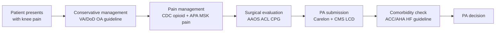

# 02 — Knowledge Base

## What is in the knowledge base and why

The knowledge base was designed to cover the complete MSK care continuum
from first presentation through surgical authorization, with cardiovascular
comorbidity assessment included because cardiac status directly affects
surgical candidacy for joint procedures.

Every document is publicly available, clinically authoritative, and
free to use for research and demo purposes.

---

## Document inventory

### 1. AAOS ACL Clinical Practice Guideline 2022

**Source:** American Academy of Orthopaedic Surgeons  
**URL:** aaos.org — Clinical Practice Guidelines — ACL Injuries  
**Size after ingestion:** ~151 chunks  
**Clinical authority:** The definitive evidence-graded guideline for ACL
injury management in the US. Every major payer and UM tool cites AAOS
CPGs as the clinical evidence standard for MSK PA criteria.

**Why it is in the KB:** ACL reconstruction is one of the highest-volume
orthopaedic procedures with high PA denial rates. The guideline contains
specific, answerable recommendations — indications for surgery, timing,
patient selection, return to sport criteria — that a UM nurse would
otherwise look up manually in a 200-page document.

**Key clinical content the system can answer from this document:**
- Surgical vs non-surgical indications for skeletally mature patients
- Timing of reconstruction and risk of delayed surgery
- Concomitant meniscal injury management
- Return to sport criteria and timing
- Evidence grades for each recommendation (Strong / Moderate / Limited)

**Evidence grading in this document:** The AAOS uses a formal grading
system. Strong recommendations have multiple high-quality RCTs behind
them. Limited recommendations have only case series or expert consensus.
The system retrieves the recommendation AND its evidence grade — a
clinician can see not just what the guideline says but how confident
the evidence base is.

---

### 2. ACC/AHA/HFSA Heart Failure Guideline 2022

**Source:** American College of Cardiology / American Heart Association  
**URL:** acc.org — Guidelines — Heart Failure 2022  
**Size after ingestion:** ~180 chunks  
**Clinical authority:** The definitive US guideline for heart failure
management. Class I recommendations have the highest evidence level.

**Why it is in the KB:** Cardiovascular comorbidities directly affect
MSK surgical candidacy. The CMS LCD for joint arthroplasty explicitly
requires cardiac risk assessment. A patient requesting total knee
replacement with HFrEF and LVEF 30% may not be cleared for elective
surgery. Having this guideline enables cross-domain queries that a
single-specialty system cannot answer.

**Key clinical content:**
- LVEF thresholds for HFrEF (≤40%), HFmrEF (41-49%), HFpEF (≥50%)
- Beta blocker indications — Class I for HFrEF
- GDMT (guideline-directed medical therapy) drug classes
- Device therapy indications — ICD, CRT thresholds
- Comorbidity management relevant to surgical risk

**The hallucination check caught something important from this document:**
During testing, the model added a claim that "there is no specific
threshold for beta blockers in HFmrEF beyond Class 2b." The hallucination
check correctly removed this because the source text only stated the
Class 2b recommendation — the model had added an interpretation that
went beyond the evidence. This is exactly the clinical safety behavior
the system is designed to exhibit.

---

### 3. CDC Clinical Practice Guideline for Prescribing Opioids 2022

**Source:** Centers for Disease Control and Prevention  
**URL:** cdc.gov — search "CDC Clinical Practice Guideline Prescribing Opioids 2022"  
**Size after ingestion:** ~160 chunks  
**Clinical authority:** Federal-level clinical guideline. Superseded the
2016 version which had a hard 90 MME/day limit that was widely
misapplied. The 2022 version emphasises individualised care.

**Why it is in the KB:** Pain management is a direct continuation of
the MSK care pathway. Post-operative pain management after ACL
reconstruction or joint arthroplasty is a common clinical question. A
UM nurse reviewing an opioid PA request post-surgery can query this
guideline from the same system she uses for surgical criteria.

**Important exclusion in this document:** The guideline explicitly
excludes patients under 18. When the system was asked about ibuprofen
dosage for children under 5, the threshold check fired (75% confidence)
and the system correctly returned "insufficient evidence" — not because
the question was outside the KB, but because the closest retrieved
content explicitly stated the guideline does not apply to paediatric
populations.

**Key clinical content:**
- Duration recommendations for acute pain (few days or less for most)
- Taper schedules for opioids prescribed more than 3-7 days
- Re-evaluation intervals (at least every 2 weeks if continuing)
- Risk assessment tools referenced
- Step therapy and non-opioid first-line requirements

---

### 4. Carelon Joint Surgery Clinical Appropriateness Guidelines 2024

**Source:** Carelon Medical Benefits Management (Elevance Health subsidiary)  
**URL:** guidelines.carelonmedicalbenefitsmanagement.com/joint-surgery-2024-11-17/  
**Size after ingestion:** ~140 chunks  
**Clinical authority:** The UM criteria used by Anthem Blue Cross,
Elevance Health, and 20+ commercial payers for joint surgery PA. Not
a clinical guideline — a payer policy document.

**Why it is in the KB:** This is the document a UM nurse actually uses
when reviewing a joint surgery PA request. It contains the specific
criteria payers require to approve procedures — which is different from
what the AAOS guideline says should be done clinically. Having both
documents means the system can answer both "what does the clinical
evidence say?" and "what does the payer require for approval?"

**The distinction that matters:** AAOS says "ACL reconstruction is
recommended when the patient has failed conservative therapy and presents
with functional instability." Carelon specifies the documentation
requirements — what evidence of failed conservative therapy is required,
what functional impairment score is needed, what imaging must be present.
These are different questions and this document answers the payer side.

---

### 5. CMS Medicare Advantage Coverage Documentation 2024

**Source:** Centers for Medicare and Medicaid Services  
**URL:** cms.gov  
**Size after ingestion:** ~80 chunks  
**Clinical authority:** Federal law — sets the baseline that all
Medicare Advantage plans must follow.

**Why it is in the KB:** Medicare and Medicare Advantage patients make
up a large portion of joint surgery volume (average age at TKA is 66).
The CMS LCD sets the minimum documentation requirements that supersede
any plan-level criteria. When a UM nurse is reviewing a Medicare
Advantage claim, the CMS LCD is the legal floor.

---

### 6. VA/DoD Clinical Practice Guideline for Knee Osteoarthritis 2020

**Source:** US Department of Veterans Affairs / Department of Defense  
**URL:** healthquality.va.gov  
**Size after ingestion:** ~120 chunks (uploaded via frontend)  
**Clinical authority:** Evidence-based guideline for a high-volume
military and veteran population with high rates of MSK injury.

**Why it is in the KB:** Covers the conservative management phase before
surgery — physical therapy, weight management, NSAIDs, injections.
Documentation of failed conservative management is a required element
for most PA approvals. This guideline defines what adequate conservative
management looks like and for how long.

---

### 7. APA Clinical Practice Guideline for Chronic Musculoskeletal Pain 2024

**Source:** American Psychological Association  
**URL:** apa.org  
**Size after ingestion:** ~130 chunks (uploaded via frontend)  
**Clinical authority:** Psychological and non-pharmacological
interventions for chronic pain — an emerging area of clinical importance.

**Why it is in the KB:** Non-pharmacological pain management is
increasingly required before opioid prescriptions and before some
surgical approvals. Cognitive-behavioural therapy, mindfulness, and
pain psychology interventions are now referenced in CMS and commercial
payer criteria as alternative treatments to try before escalation.

---

## The clinical pathway these documents cover together

A single system that covers all six stages of this pathway — from
conservative management through PA decision — is what a comprehensive
UM intelligence tool looks like. No single payer tool or clinical
decision support system currently covers the full pathway in one interface.

---

## What the knowledge base does NOT cover

**Intentional gaps:**

- Specific drug formulary criteria — these change quarterly per payer
  and cannot be kept current from static PDFs
- Post-surgical rehabilitation protocols — out of scope for PA workflow
- Paediatric MSK — the guidelines in the KB explicitly exclude patients
  under 18 in most cases

**Gaps that would be filled in a production system:**

- NCCN oncology guidelines — for oncology PA workflow extension
- InterQual and MCG criteria — proprietary, require licensing
- Real-time formulary data — requires payer API integration
- FHIR-connected patient data — requires Epic / Cerner integration

---

## How chunks map to clinical questions

| Clinical question | Primary source | Secondary source |
|---|---|---|
| ACL reconstruction indications | AAOS ACL CPG | CMS LCD |
| Conservative therapy requirements | VA/DoD OA guideline | Carelon criteria |
| PA documentation requirements | Carelon guidelines | CMS LCD |
| Opioid prescribing duration | CDC opioid guideline | — |
| Beta blocker threshold in HFrEF | ACC/AHA HF guideline | — |
| Surgical risk in cardiac patients | ACC/AHA HF guideline | Carelon criteria |
| Non-pharmacological pain options | APA MSK pain guideline | CDC opioid guideline |
| Medicare coverage requirements | CMS LCD | — |

The most impressive demo moment is a cross-document query — one that
retrieves from both a clinical guideline and a payer criteria document
simultaneously and synthesises an answer that addresses both the clinical
evidence and the administrative requirement.
