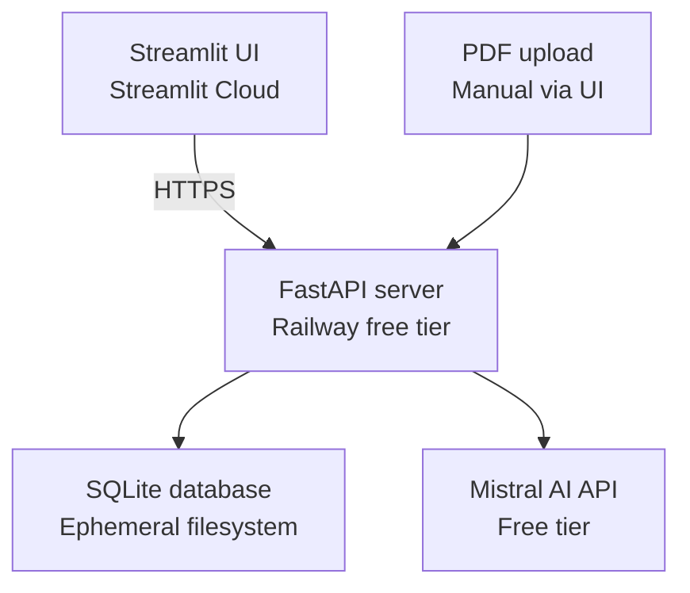
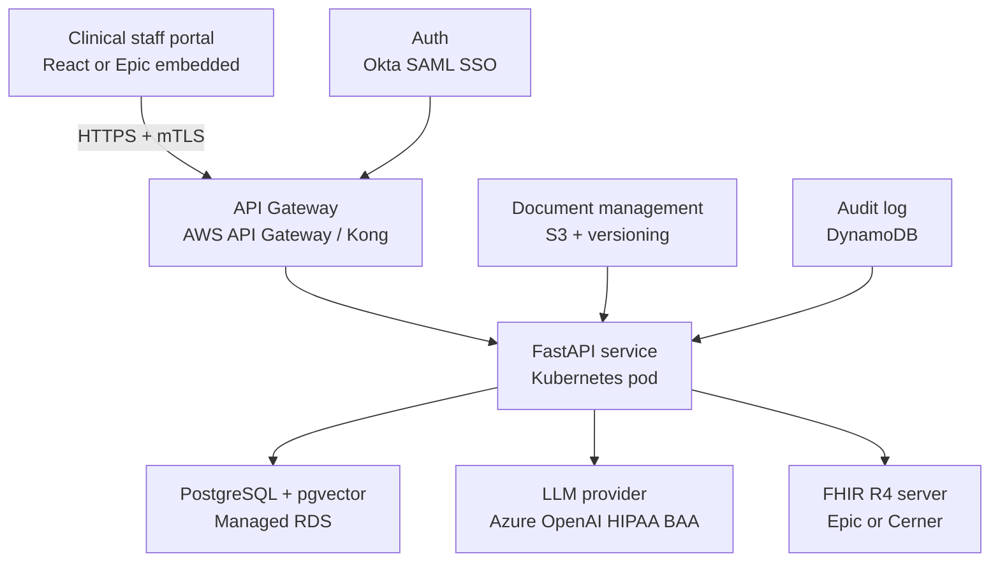
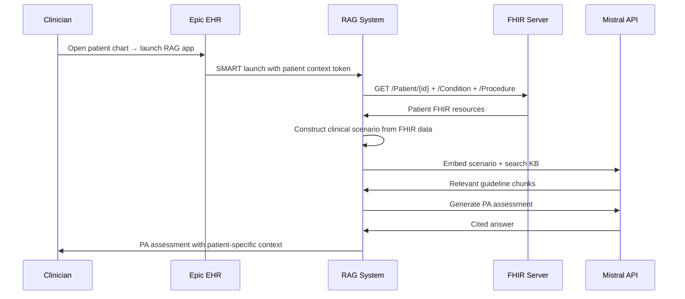

# 05 — Enterprise Architecture

## What this looks like at health system scale

The current implementation is a demo-grade system that proves the
architecture works. This document describes what the same architecture
looks like when deployed in a production health system — the
infrastructure changes, the integration points, and the compliance
requirements.

Nothing about the core pipeline changes. The retrieval logic, the
generation approach, the safety layers — all of these are production-ready
as designed. What changes is the surrounding infrastructure.

---

## Current architecture vs enterprise architecture

### Current (demo)



### Enterprise target



---

## The HIPAA question

The current system sends query text to Mistral's API. If a clinician
types a patient scenario containing clinical details — even without a
name — that text may constitute PHI depending on the specificity.

**Current mitigation:** PII check before any API call using regex
patterns for SSNs, MRNs, DOBs, and patient names.

**Production requirement:** A Business Associate Agreement (BAA) with
the LLM provider. This is a legal agreement that makes the provider
responsible for PHI under HIPAA.

**Options with BAA availability:**
- Microsoft Azure OpenAI Service — HIPAA BAA available
- AWS Bedrock (Claude, Llama) — HIPAA BAA available
- Google Cloud Vertex AI — HIPAA BAA available
- Mistral via Azure marketplace — HIPAA BAA available through Azure

**Option without external API:** Run a local LLM on-premises.
Llama 3.1 70B via Ollama on a GPU server. No PHI leaves the health
system's infrastructure. Higher operational cost but eliminates the
BAA dependency entirely.

---

## The database at scale

### Current: SQLite + numpy in-memory search

Loading all 2868 embeddings into memory on every query works for a
single-user demo. The math:

- 2868 chunks × 1024 dimensions × 4 bytes (float32) = 11.7 MB per query
- Acceptable on a server with 512MB RAM

**At scale:**

| Documents | Chunks (est.) | Memory per query | Status |
|---|---|---|---|
| 7 guidelines (current) | 2,868 | 11.7 MB | Acceptable |
| 50 guidelines | ~20,000 | 82 MB | Acceptable |
| 500 guidelines | ~200,000 | 820 MB | Borderline |
| 5,000 guidelines | ~2,000,000 | 8.2 GB | Fails |

### Production: PostgreSQL + pgvector

pgvector is a PostgreSQL extension that stores vectors natively and
supports approximate nearest neighbor (ANN) search using HNSW or
IVFFlat indexes.

The migration from SQLite to pgvector requires:

1. Schema change — add a `vector(1024)` column
2. Index creation — `CREATE INDEX ON chunks USING hnsw (embedding vector_cosine_ops)`
3. Query change — replace numpy cosine similarity with
   `SELECT ... ORDER BY embedding <=> query_vector LIMIT 10`
4. Connection pooling — PgBouncer for concurrent users

HNSW (Hierarchical Navigable Small World) trades a small amount of
recall for massive speed improvement — searching 2 million vectors
takes milliseconds instead of seconds.

### Why not a dedicated vector database

Pinecone, Weaviate, Qdrant — these are purpose-built vector databases
with managed infrastructure, replication, and scalability. The reasons
to choose pgvector over them in a health system context:

**Data sovereignty:** PHI must stay in a system the health system
controls. Sending PHI to a third-party vector database adds another
entity that needs a BAA and another attack surface.

**Operational simplicity:** Health system IT teams know PostgreSQL.
They have runbooks, backup procedures, monitoring, and DBAs for it.
A novel vector database is an operational burden.

**Capability:** For a guideline-based RAG system, pgvector's HNSW
index is sufficient for millions of chunks with sub-10ms query times.
Dedicated vector databases add complexity without meaningful benefit
at this scale.

---

## FHIR integration — the enterprise value multiplier

The current system answers questions from static PDFs. The enterprise
version answers questions by combining guideline content with live
patient data from the EHR via FHIR R4.

### What FHIR enables

Instead of a clinician typing "patient with ACL tear, 6 weeks PT,
positive Lachman, requesting reconstruction", the system pulls:

```json
{
  "patient": {"age": 28, "gender": "F"},
  "conditions": [{"code": "S83.5", "display": "ACL tear", "onset": "2026-02-01"}],
  "procedures": [{"code": "97110", "display": "Physical therapy", "count": 18, "period": "6 weeks"}],
  "diagnostics": [{"type": "MRI knee", "finding": "Complete ACL tear with bone bruise"}]
}
```

The system constructs the clinical scenario from structured data,
embeds and searches the knowledge base, and returns a PA assessment
pre-populated with the patient's actual data.

### The SMART on FHIR flow



### Current gap in the system

The current system has no FHIR integration. A clinician must manually
type the patient scenario. In an enterprise deployment, this is the
highest-value integration — it eliminates the manual data entry step
and reduces the risk of transcription errors.

The FHIR integration layer would be a new component — `agent/fhir.py` —
that calls the Epic FHIR API, constructs a structured clinical scenario,
and passes it to the existing pipeline. The pipeline itself does not
change.

---

## Audit and compliance

Every AI-generated clinical answer in a regulated healthcare environment
must be auditable. The current system logs nothing.

### What an audit log must contain

```sql
CREATE TABLE audit_log (
    id            UUID PRIMARY KEY,
    timestamp     TIMESTAMPTZ NOT NULL,
    user_id       TEXT,          -- clinician ID from SSO
    patient_id    TEXT,          -- FHIR patient ID if applicable (hashed)
    query_raw     TEXT,          -- original query
    query_rewritten TEXT,        -- after rewrite
    intent        TEXT,          -- SEARCH / CHAT / REFUSED
    top_score     FLOAT,         -- retrieval confidence
    sources       JSONB,         -- chunks retrieved with source + page
    answer        TEXT,          -- final answer
    hallucination_check_removed BOOLEAN,
    response_ms   INTEGER        -- latency
);
```

This table answers:
- What did the system tell this clinician about this patient?
- Was the answer based on current guidelines?
- Did the hallucination check fire?
- What was the retrieval confidence?

In a Joint Commission audit, a malpractice case, or a regulatory review,
this log is the evidence that the AI-generated recommendation was
grounded in evidence and not a hallucination.

---

## Authentication and access control

The current system has no authentication. Anyone with the URL can query
the system.

**Enterprise requirements:**
- SAML SSO via Okta or Azure AD — single sign-on with the health
  system's existing identity provider
- Role-based access control — UM nurses see payer criteria; physicians
  see clinical recommendations; researchers see aggregate data
- Session tokens with 8-hour expiry
- Audit log tied to authenticated user identity

---

## Document management and versioning

Clinical guidelines update annually. Payer criteria update quarterly.
The current system has no document versioning.

**Production requirement:**

When AAOS releases ACL CPG 2025:
1. The new PDF is ingested with a version tag
2. Old chunks are marked as superseded, not deleted
3. Queries run against the current version by default
4. Researchers can query historical versions for comparative analysis
5. Every generated answer includes the guideline version and publication
   date in the citation

The chunks table needs two new columns:
```sql
version     TEXT,        -- "2022", "2025"
is_current  BOOLEAN,     -- false when superseded
```

---

## Latency at scale

Current response time: 8-12 seconds (dominated by Mistral API calls).

**At enterprise scale with optimisation:**

| Component | Current | Optimised |
|---|---|---|
| PII check | <10ms | <10ms |
| Intent detection | 1-2s | 200ms (mistral-small) |
| Query rewrite | 1-2s | 200ms (mistral-small) |
| Hybrid search | 50ms | 10ms (pgvector HNSW) |
| Generation | 3-4s | 2-3s (streaming response) |
| Hallucination check | 3-4s | Optional — skip for >0.90 confidence |
| **Total** | **8-12s** | **3-4s** |

The three biggest levers:
1. Use `mistral-small` for intent detection and query rewrite (5-10×
   cheaper, 3× faster, nearly identical quality for classification)
2. Stream the generation response — show tokens as they arrive rather
   than waiting for the complete answer
3. Cache frequent queries — if 20% of queries are the same PA criteria
   lookup, cache with Redis TTL=1 hour

---

## The five production gaps and their fixes

| Gap | Current | Production fix |
|---|---|---|
| In-memory search | numpy exhaustive | pgvector HNSW index |
| Ephemeral storage | SQLite on Railway | PostgreSQL RDS with backups |
| Synchronous endpoints | Blocking Mistral calls | asyncio.to_thread |
| No authentication | Open URL | SAML SSO + RBAC |
| No audit trail | No logging | Structured audit log table |

None of these gaps affect the correctness of the pipeline for demo
purposes. All of them must be addressed before any clinical deployment.
The architecture supports all five fixes without changing the core
retrieval or generation logic.
