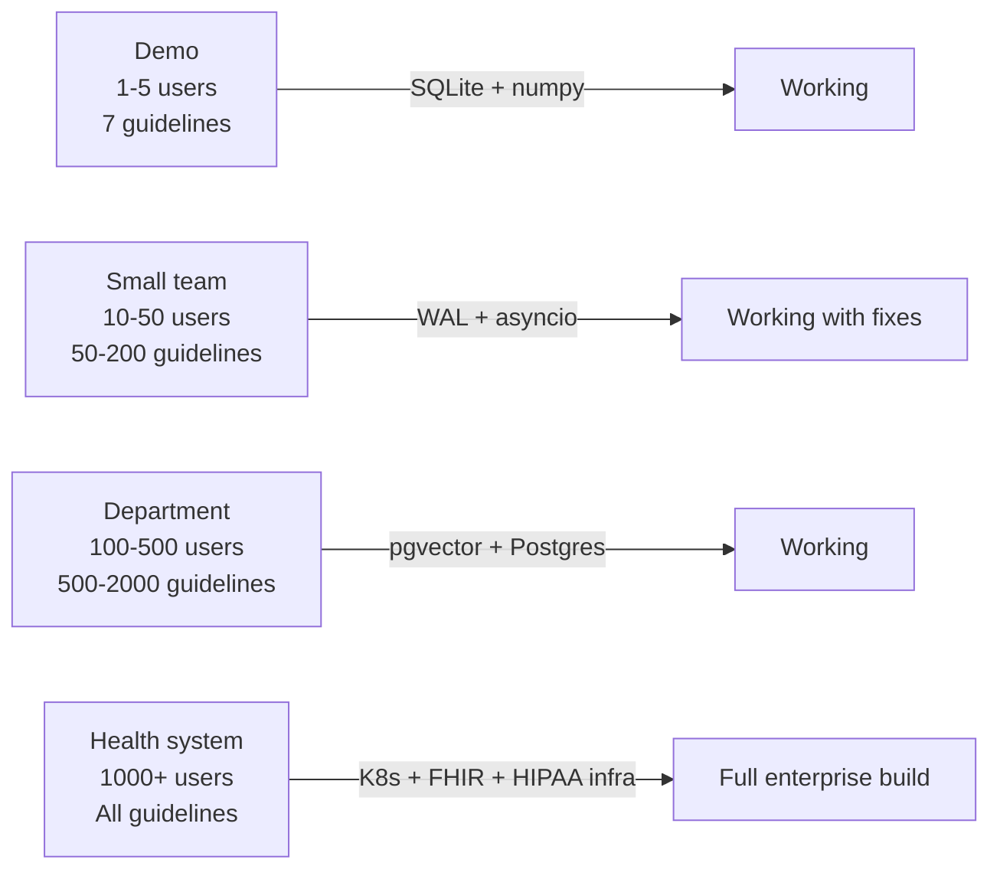

# 06 — Failure Modes and Scaling

## How to think about failure in a clinical AI system

A clinical AI system has two categories of failure:

**Silent failure** — the system returns a wrong answer confidently. This
is the dangerous category. A hallucinated drug dosage, an incorrect
threshold, a fabricated guideline citation — these can influence clinical
decisions.

**Loud failure** — the system crashes, returns an error, or explicitly
refuses to answer. This is the safe category. A system that goes down
is annoying. A system that confidently generates wrong clinical
information is dangerous.

Every design decision in this pipeline prioritises loud failure over
silent failure. The 0.70 threshold, the hallucination check, the
insufficient evidence response — all of these are mechanisms to
convert potential silent failures into loud ones.

---

## Known failure modes — ranked by severity

### Severity 1 — Silent clinical error (most dangerous)

**Failure:** The system retrieves plausible but wrong chunks and
generates a fluent, cited, incorrect answer.

**Example:** A query about "LVEF threshold for ICD implantation" retrieves
a chunk about general HFrEF management rather than the specific device
therapy section. The generated answer states a threshold that is
clinically close but wrong.

**Current mitigation:** Hallucination check reduces this risk but does
not eliminate it — the check verifies claims against retrieved chunks,
not against ground truth. If the wrong chunk is retrieved, the
hallucination check will pass an incorrect answer.

**Production fix:**
- Curated test set of clinical questions with verified correct answers
- Automated retrieval evaluation (MRR, NDCG) run on every code change
- Human expert review of answers flagged as low-confidence

**Why this matters:** This is the only failure mode that could cause
patient harm if a clinician acts on the answer without independent
verification. The medical disclaimer addresses this, but the system
design itself must minimise the probability.

---

### Severity 2 — Rate limit exhaustion (service outage)

**Failure:** The Mistral free tier rate limit (code 429) exhausts during
a burst of queries. The pipeline raises an unhandled exception.

**Current mitigation:** Exponential backoff retry (5 attempts, 3-33
second waits). None guard in pipeline.py returns a user-friendly error
message instead of a 500 crash.

**Observed behaviour:** During rapid testing, multiple 429 errors
appeared across both the embedding and generation calls. The backoff
handled most; a few exhausted all retries.

**Production fix:**
- Paid Mistral tier — eliminates rate limits
- Circuit breaker pattern — if 3 consecutive requests fail, stop
  accepting new requests for 60 seconds rather than retrying endlessly
- Queue-based processing — for high-volume environments, queue requests
  and process asynchronously rather than blocking the HTTP request

---

### Severity 3 — In-memory search OOM (scalability ceiling)

**Failure:** At >200,000 chunks, loading all embeddings into memory per
query exceeds available RAM and the process is killed.

**Current state:** 2868 chunks = 11.7MB. Acceptable.

**Ceiling:** ~50,000 chunks before memory pressure becomes noticeable
on a 512MB Railway free tier instance.

**Production fix:** pgvector HNSW index — O(log n) approximate nearest
neighbor search instead of O(n) exhaustive comparison.

**Why not urgent for demo:** The knowledge base at 7 guidelines has
2868 chunks. Even at 50 guidelines it would be ~20,000 chunks. The
ceiling is not reached for a reasonable guideline-based system.

---

### Severity 4 — SQLite concurrency (data corruption risk)

**Failure:** Two users upload PDFs simultaneously. SQLite allows only
one writer at a time. One upload fails with "database is locked" and
the other may partially succeed, leaving the database in an inconsistent
state.

**Current mitigation:** None — but this requires simultaneous uploads
from multiple users, which is unlikely in a demo environment.

**One-line partial fix:** WAL (Write-Ahead Logging) mode:
```python
conn.execute("PRAGMA journal_mode=WAL")
```
WAL mode allows concurrent readers and reduces write conflicts but does
not fully solve the problem under high write concurrency.

**Production fix:** PostgreSQL — designed for concurrent access with
MVCC (Multi-Version Concurrency Control).

---

### Severity 5 — Ephemeral storage (data loss on restart)

**Failure:** On Railway free tier, the filesystem resets when the service
restarts or redeploys. The SQLite database at `data/clinical_rag.db`
is lost. All ingested documents must be re-ingested.

**Current workaround:** `seed_demo.py` re-ingests demo PDFs on every
startup. This adds ~2-3 minutes of startup time.

**Production fix:**
- Railway persistent volumes (paid plan)
- Move to PostgreSQL on managed RDS — database is independent of the
  application server lifecycle

---

### Severity 6 — No input length validation (cost amplification)

**Failure:** A user sends a 100,000-character query. This exceeds the
embedding model's token limit. The API call fails with a context length
error. In the worst case, it generates an enormous number of tokens on
the generation call at high cost.

**Current state:** No validation on query length.

**Production fix:**
```python
class QueryRequest(BaseModel):
    question: str

    @validator('question')
    def question_length(cls, v):
        if len(v) > 2000:
            raise ValueError('Query must be under 2000 characters')
        return v.strip()
```

This is a 5-line change that prevents both the API error and the cost
amplification.

---

### Severity 7 — No rate limiting on API endpoints (abuse)

**Failure:** Anyone with the Railway URL can send unlimited queries,
burning through the API key budget.

**Current state:** No rate limiting.

**Production fix:**
```python
from slowapi import Limiter, _rate_limit_exceeded_handler
from slowapi.util import get_remote_address

limiter = Limiter(key_func=get_remote_address)
app.state.limiter = limiter

@app.post("/query")
@limiter.limit("10/minute")
async def query(request: Request, body: QueryRequest):
    ...
```

10 queries per minute per IP is sufficient for clinical use — a
clinician asking questions in real-time does not need more than one
per 6 seconds.

---

## The BM25 rebuild problem

**Current behaviour:** On every query, BM25 recomputes term frequencies
and IDF scores from all 2868 chunks in the database. For 2868 chunks
this is fast (< 50ms). For 200,000 chunks it would be the query
bottleneck.

**What BM25 actually needs to rebuild on:**
- New documents ingested (IDF values change)
- Documents deleted

**What it does NOT need to rebuild on:**
- A new query arrives

**Production fix:** Build and cache the BM25 index at server startup
using FastAPI's startup event:

```python
@app.on_event("startup")
async def startup():
    app.state.bm25_index = build_bm25_index()
    app.state.chunks = load_all_chunks()
```

Invalidate the cache only when `/ingest` succeeds. This converts an
O(n) per-query operation to an O(1) per-query operation with an
O(n) amortised cost paid only on ingestion.

---

## Scaling summary



The architecture supports this progression. The core pipeline — intent
detection, query rewrite, hybrid search, generation, hallucination check
— does not change at any scale. What changes is the surrounding
infrastructure: database, caching, deployment, authentication, audit.

This is the right way to think about the system: production-ready in
architecture, demo-grade in infrastructure. The path from here to
enterprise is a series of independent infrastructure upgrades, not a
rewrite.
